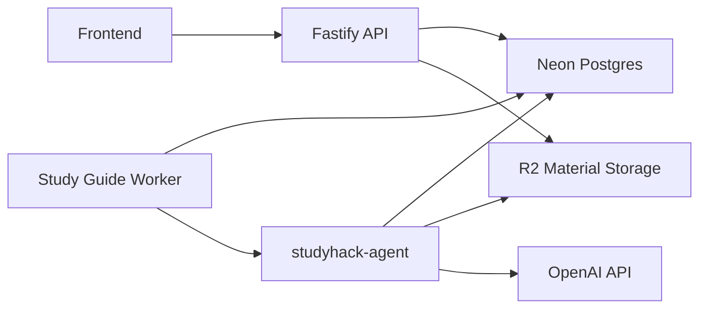
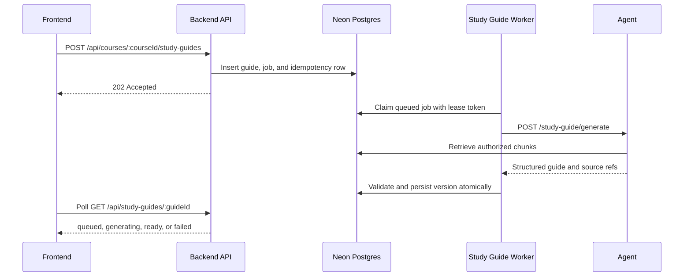
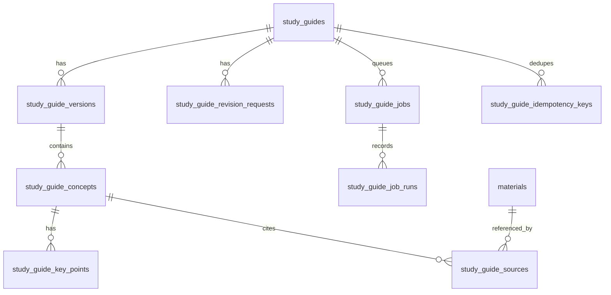
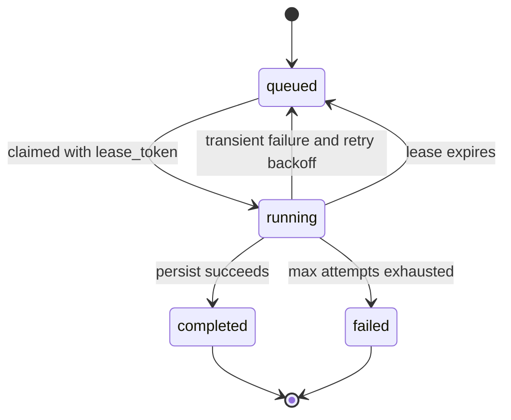
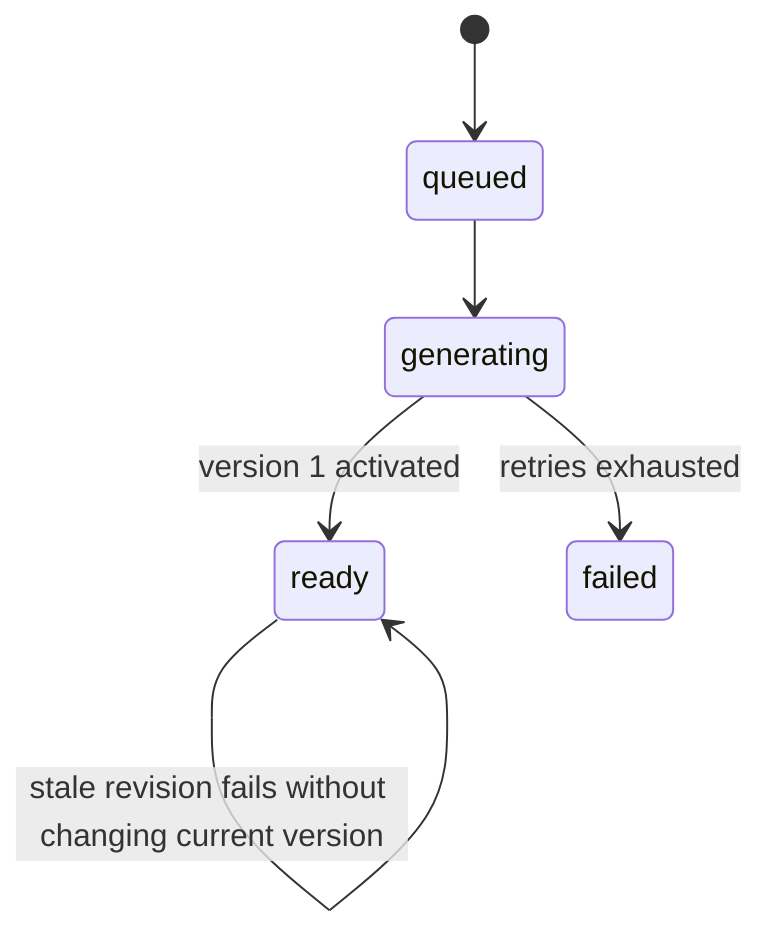
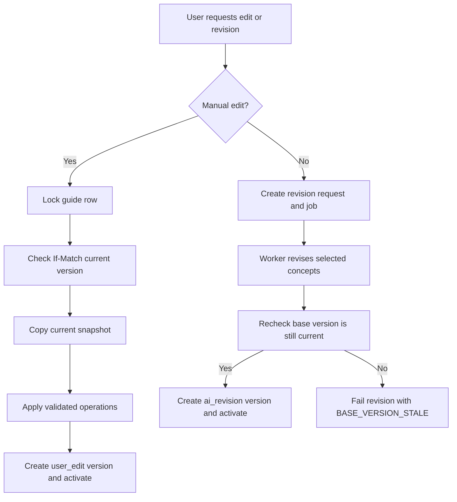

# *Study Guide Backend* Design Doc

# Problem Context

*Build a persistent Study Guide that matches the Figma design. Instead of streaming temporary markdown, guides are generated, saved, and can be reopened later. The implementation spans the frontend, backend, and AI agent, while the existing StudyAiApplication documents are used only as design references—not as features to implement.*

# Proposed Solution

*Introduce a persisted, versioned Study Guide resource. Initial generation and AI revision run asynchronously through a dedicated worker process; manual edits create a new immutable version synchronously. The worker calls `studyhack-agent`, and the completed output is validated and saved atomically. The existing streaming endpoint remains available during migration.*

# Goals and Non-Goals

## Goals

* *Persist generated Study Guides.*  
* *Support retrieval from **Only my files** and **Class knowledge base**.*  
* *Store structured concepts, key points, and citations.*  
* *Validate agent output and expose generation status.*  
* *Reuse existing authentication, retrieval, and preview infrastructure.*
* *Support owner-only manual editing and AI-assisted revision without overwriting prior versions.*  

## Non-Goals

* *Implementing persisted practice questions or tutor chat in phase 1\.*  
* *Implementing publishing, discovery, search, or ranking in phase 1\.*  
* *Standalone thumbs-up/down feedback and feedback-triggered revision. Phase 1 revision is an explicit owner instruction against an exact version.*  
* *Migrating to the new course-offering architecture.*  

# Design

## 1\. Responsibilities

* **Fastify API service:** Clerk authentication, enrollment checks, retrieval-mode validation, idempotency, request validation, and owner-scoped reads and writes.  
* **Study Guide worker:** A separate Railway process deployed from `studyhack-backend`. It claims durable generation/revision jobs, calls the Agent, validates its response, and persists complete versions.  
* **Agent retrieval service:** Deterministic pgvector query over course and owner fields. It returns only authorized chunks and source metadata to generation.  
* **Agent generation module:** Structured synthesis from supplied chunks. The language model cannot query the database or widen scope.  
* **Frontend:** Create/poll/render the guide, render LaTeX with the existing KaTeX stack, and open citations with the current material preview endpoint.



## 2\. Retrieval modes

* **personal:** course\_id matches and owner\_user\_id equals the authenticated user. Do not require scope=personal because current course uploads are stored as shared while retaining owner provenance.  
* **course:** course\_id matches. This includes the enrolled class knowledge base; citations from the current user are labeled personal and citations from other uploaders are labeled shared.

**Authorization rule:** The backend derives userId from Clerk and verifies enrollment before calling the agent. The browser never supplies userId.

## 3\. Workflow

1. *The backend validates the request, creates a queued Study Guide and a durable generation job, and immediately returns `202 Accepted`.*  
2. *The dedicated Study Guide worker processes the job and calls `AgentClient.generateStudyGuide()`.*  
3. *The agent retrieves authorized course materials and generates a structured Study Guide with source references.*  
4. *The backend validates the response, persists the guide in a transaction, and updates its status.*  
5. *The frontend polls the guide status until it is `ready` or `failed`.*



### Worker deployment decision

The Study Guide worker is a third Railway deploy target in the same Railway project. It is not a new codebase: both API and worker deploy from `studyhack-backend`, but use different entrypoints.

```text
studyhack-backend-api
  start: node dist/server.js
  DB_POOL_MAX=5

studyhack-study-guide-worker
  start: node dist/worker.js
  DB_POOL_MAX=3
  no public domain or HTTP health check

studyhack-agent
  start: node dist/server.js
  existing Agent and embed-worker responsibilities
```

`db.ts` reads `DB_POOL_MAX` instead of hard-coding five connections. Because API, Study Guide worker, Agent, Metabase, migrations, and administrative clients all connect to the same Neon compute, the deployment budget is:

```text
API service pool                  5
Study Guide worker pool           3
Agent service pool                5
Metabase/admin/migration headroom  5
-----------------------------------
Planned maximum                   18 connections
```

The active Neon compute must expose at least 28 PostgreSQL connections before this worker is enabled: 18 planned connections plus 10 reserved connections for provider/system overhead and emergency admin access. The exact ceiling must be verified from Neon for the target compute size during deploy review; if the project runs on a smaller or quota-constrained compute, reduce `DB_POOL_MAX` before enabling the worker. A `pg.Pool` maximum is a per-process upper bound, not a reservation.

The Study Guide worker copies the existing team's polling model, but it does not run inside Fastify or reuse the Agent embed-worker process. The current embed poller does not provide the required durable claim semantics. Study Guide jobs are claimed in a short transaction with `FOR UPDATE SKIP LOCKED`, a lease, and a worker ID. Agent HTTP calls occur after that transaction commits and releases its database connection.

The worker begins with one process, execution concurrency of two, and `DB_POOL_MAX=3`; these are initial operational values and must be tuned from queue age, latency, and Neon connection metrics. On `SIGTERM`, it stops claiming work, finishes or relinquishes the active lease, closes its pool, and exits.

The initial queue settings are a two-second poll interval, one active generation/revision per user, two active jobs per course, a two-minute lease, and a 30-second heartbeat. Retry backoff starts at 30 seconds, doubles per failed attempt, caps at five minutes, and stops after three attempts. These values are configuration, not hard-coded product constants.

The worker is an always-on Railway background service. Railway serverless sleeping is not relied upon: polling and open database connections generate outbound traffic, and a sleeping worker has no inbound request that reliably wakes it when a database job is inserted. Railway cron is also not used because its minimum cadence is unsuitable for an interactive generation flow.

Infrastructure status: this repository provides the worker entrypoint (`src/worker.ts`, `npm run start:study-guide-worker`, compiled as `dist/worker.js`), but the checked-in `railway.json` still configures only the public API service (`node dist/server.js`). The third Railway service must be created in Railway with `startCommand = node dist/worker.js`, no public domain, no HTTP health check, and the worker-specific environment (`DB_POOL_MAX=3`, agent URL, auth token, and shared database URL). Until that service exists, merging this backend PR adds the durable queue and worker code but does not make Study Guide generation run in staging or production.

Only one deployment path runs migrations. The worker starts only after compatible migrations are applied; API and worker deploys must not race the same migration command.

## 4\. APIs (Phase 1\)

```
POST /api/courses/:courseId/study-guides
Idempotency-Key: <client-generated-key>
Content-Type: application/json

{
  "target": "Midterm 1",
  "retrievalMode": "personal"
}
```

Create one queued guide. Requires Idempotency-Key. Returns 202 Accepted.

```
GET /api/courses/:courseId/study-guides
```

List only the authenticated user's guides in the enrolled course.

```
GET /api/study-guides/:guideId
```

Return queued/generating/failed status or the current complete structured version. Cross-user access is 404\.

```http
GET /api/study-guides/:guideId/versions
GET /api/study-guides/:guideId/versions/:versionId
```

List version metadata or return one immutable historical version. Both endpoints are owner-only in Phase 1.

```http
POST /api/study-guides/:guideId/edits
Idempotency-Key: <client-generated-key>
If-Match: "<baseVersionId>"
Content-Type: application/json

{
  "operations": [
    {
      "type": "updateConcept",
      "conceptId": "stable-logical-concept-id",
      "summary": "Edited summary",
      "keyPoints": ["First point", "Second point"]
    }
  ]
}
```

Apply a bounded set of manual edits and synchronously create one immutable `user_edit` version. Phase 1 operations are `updateGuide` for title/summary and `updateConcept` for title/category/summary/keyPoints. Adding, deleting, or reordering concepts is excluded. Every operation is validated before writing; the change set either commits completely or has no effect. If `If-Match` is not the current version, return `409 VERSION_CONFLICT` with the current version ID.

The request contains 1-20 operations. Titles are at most 200 characters, summaries and revision instructions at most 10,000 characters, and a concept has 1-20 key points of at most 2,000 characters each. Empty strings are rejected after trimming. The same limits apply to Agent output.

```http
POST /api/study-guides/:guideId/revisions
Idempotency-Key: <client-generated-key>
Content-Type: application/json

{
  "baseVersionId": "version-uuid",
  "instruction": "Make the recurrence section easier to understand",
  "conceptIds": ["stable-logical-concept-id"]
}
```

Create an asynchronous AI revision request and `revise_guide` job, then return `202 Accepted` with `revisionId`, `guideId`, `baseVersionId`, and `status=queued`. `conceptIds` is required in Phase 1, so an AI revision can change only explicitly selected concepts. The base version must still be current when the request is created.

```http
GET /api/study-guides/:guideId/revisions/:revisionId
```

Return queued/running/completed/failed revision status. On completion it includes the new version ID. A failed revision leaves the current guide version unchanged.

```
GET /api/materials/:materialId/preview
```

Reuse the existing authorized preview endpoint. The frontend appends \#page=N from the source row after constructing the preview URL.

All Study Guide JSON errors use the existing backend `message` field plus a stable feature code:

```json
{
  "message": "The guide changed before this update was applied.",
  "code": "VERSION_CONFLICT",
  "details": {
    "currentVersionId": "version-uuid"
  }
}
```

`details` contains only safe machine-readable fields. Ownership failures return `404` and do not reveal whether another user's guide/version/revision exists. List endpoints return at most the latest 50 records in Phase 1, ordered newest first. The frontend begins status polling after two seconds and uses capped backoff; a browser disconnect does not cancel a durable job.

## 5\. Data Model

Phase 1 adds the following tables. The SQL is the logical migration contract; migration numbering is assigned when implementation begins.



```sql
CREATE TABLE study_guides (
  id uuid PRIMARY KEY DEFAULT gen_random_uuid(),
  owner_user_id uuid NOT NULL REFERENCES users(id),
  course_id uuid NOT NULL REFERENCES courses(id),
  target text NOT NULL,
  retrieval_mode text NOT NULL,
  current_version_id uuid,
  status text NOT NULL DEFAULT 'queued',
  error_code text,
  error_message text,
  created_at timestamptz NOT NULL DEFAULT now(),
  updated_at timestamptz NOT NULL DEFAULT now(),
  ready_at timestamptz,
  CHECK (retrieval_mode IN ('personal', 'course')),
  CHECK (status IN ('queued', 'generating', 'ready', 'failed')),
  CHECK (
    (status = 'failed' AND error_code IS NOT NULL)
    OR status <> 'failed'
  )
);

CREATE INDEX idx_study_guides_owner_course_created
  ON study_guides (owner_user_id, course_id, created_at DESC);

CREATE TABLE study_guide_versions (
  id uuid PRIMARY KEY DEFAULT gen_random_uuid(),
  guide_id uuid NOT NULL REFERENCES study_guides(id) ON DELETE CASCADE,
  version_number integer NOT NULL CHECK (version_number > 0),
  origin text NOT NULL,
  base_version_id uuid,
  created_by_user_id uuid REFERENCES users(id),
  title text NOT NULL,
  summary text NOT NULL,
  created_at timestamptz NOT NULL DEFAULT now(),
  CHECK (origin IN ('generated', 'user_edit', 'ai_revision')),
  UNIQUE (guide_id, version_number),
  UNIQUE (id, guide_id),
  FOREIGN KEY (base_version_id, guide_id)
    REFERENCES study_guide_versions(id, guide_id)
);

ALTER TABLE study_guides
  ADD CONSTRAINT fk_study_guides_current_version
  FOREIGN KEY (current_version_id, id)
  REFERENCES study_guide_versions(id, guide_id);

CREATE TABLE study_guide_concepts (
  id uuid PRIMARY KEY DEFAULT gen_random_uuid(),
  version_id uuid NOT NULL REFERENCES study_guide_versions(id) ON DELETE CASCADE,
  logical_concept_id uuid NOT NULL,
  title text NOT NULL,
  category text,
  summary text NOT NULL,
  content_origin text NOT NULL,
  sort_order integer NOT NULL CHECK (sort_order >= 0),
  CHECK (content_origin IN ('generated', 'user_edit', 'ai_revision')),
  UNIQUE (version_id, logical_concept_id),
  UNIQUE (version_id, sort_order)
);

CREATE TABLE study_guide_key_points (
  id uuid PRIMARY KEY DEFAULT gen_random_uuid(),
  concept_id uuid NOT NULL REFERENCES study_guide_concepts(id) ON DELETE CASCADE,
  content text NOT NULL,
  sort_order integer NOT NULL CHECK (sort_order >= 0),
  UNIQUE (concept_id, sort_order)
);

CREATE TABLE study_guide_sources (
  id uuid PRIMARY KEY DEFAULT gen_random_uuid(),
  concept_id uuid NOT NULL REFERENCES study_guide_concepts(id) ON DELETE CASCADE,
  material_id uuid NOT NULL REFERENCES materials(id),
  page integer CHECK (page IS NULL OR page > 0),
  snippet text NOT NULL,
  score real NOT NULL CHECK (score >= 0 AND score <= 1),
  sort_order integer NOT NULL CHECK (sort_order >= 0),
  UNIQUE (concept_id, sort_order)
);

CREATE TABLE study_guide_revision_requests (
  id uuid PRIMARY KEY DEFAULT gen_random_uuid(),
  guide_id uuid NOT NULL REFERENCES study_guides(id) ON DELETE CASCADE,
  owner_user_id uuid NOT NULL REFERENCES users(id),
  base_version_id uuid NOT NULL,
  result_version_id uuid,
  instruction text NOT NULL,
  concept_ids uuid[] NOT NULL,
  status text NOT NULL DEFAULT 'queued',
  error_code text,
  created_at timestamptz NOT NULL DEFAULT now(),
  started_at timestamptz,
  completed_at timestamptz,
  CHECK (cardinality(concept_ids) BETWEEN 1 AND 20),
  CHECK (status IN ('queued', 'running', 'completed', 'failed')),
  CHECK (
    (status = 'completed' AND result_version_id IS NOT NULL)
    OR status <> 'completed'
  ),
  FOREIGN KEY (base_version_id, guide_id)
    REFERENCES study_guide_versions(id, guide_id),
  FOREIGN KEY (result_version_id, guide_id)
    REFERENCES study_guide_versions(id, guide_id)
);

CREATE INDEX idx_study_guide_revisions_guide_created
  ON study_guide_revision_requests (guide_id, created_at DESC);
```

All asynchronous Study Guide work uses one proposed durable job table. Phase 1 uses `generate_guide` and `revise_guide`; future phases add publish, indexing, ranking, recommendation, and cache-warming job types without introducing another queue table. This table and its worker do not exist in the current repositories.

```sql
CREATE TABLE study_guide_jobs (
  id uuid PRIMARY KEY DEFAULT gen_random_uuid(),
  type text NOT NULL,
  scope_type text NOT NULL,
  scope_id uuid NOT NULL,
  guide_id uuid REFERENCES study_guides(id) ON DELETE CASCADE,
  owner_user_id uuid REFERENCES users(id),
  dedupe_key text NOT NULL,
  status text NOT NULL DEFAULT 'queued',
  priority integer NOT NULL DEFAULT 0,
  payload jsonb NOT NULL DEFAULT '{}',
  attempts integer NOT NULL DEFAULT 0 CHECK (attempts >= 0),
  max_attempts integer NOT NULL DEFAULT 3 CHECK (max_attempts > 0),
  run_after timestamptz NOT NULL DEFAULT now(),
  locked_at timestamptz,
  lease_expires_at timestamptz,
  lease_token uuid,
  locked_by text,
  last_error_code text,
  created_at timestamptz NOT NULL DEFAULT now(),
  updated_at timestamptz NOT NULL DEFAULT now(),
  completed_at timestamptz,
  CHECK (type IN (
    'generate_guide',
    'revise_guide',
    'publish_guide',
    'search_index_guide',
    'ranking_refresh',
    'recommendation_refresh',
    'cache_warm'
  )),
  CHECK (scope_type IN ('guide', 'user', 'course', 'segment')),
  CHECK (status IN ('queued', 'running', 'completed', 'failed')),
  CHECK (
    (scope_type = 'guide' AND guide_id = scope_id)
    OR (scope_type <> 'guide' AND guide_id IS NULL)
  )
);

CREATE UNIQUE INDEX uq_study_guide_jobs_active_dedupe
  ON study_guide_jobs (dedupe_key)
  WHERE status IN ('queued', 'running');

CREATE INDEX idx_study_guide_jobs_claim
  ON study_guide_jobs (type, status, priority DESC, run_after, created_at)
  WHERE status = 'queued';
```



The partial unique index deduplicates only active work. A later refresh may reuse the same logical dedupe\_key after the previous job reaches completed or failed.

Claiming sets `status='running'`, increments `attempts`, and assigns a new random `lease_token`, `locked_by`, and `lease_expires_at`. Heartbeats and final persistence must match both job ID and lease token. If a lease expires, a short recovery transaction returns the job to queued and clears its lock fields. A late worker holding an old token cannot heartbeat, complete, or persist a version; it discards its result.

Idempotency for the public Generate API is separate from background-job deduplication:

```sql
CREATE TABLE study_guide_idempotency_keys (
  owner_user_id uuid NOT NULL REFERENCES users(id),
  idempotency_key text NOT NULL,
  operation_type text NOT NULL,
  request_hash text NOT NULL,
  guide_id uuid NOT NULL REFERENCES study_guides(id) ON DELETE CASCADE,
  response_status integer NOT NULL DEFAULT 202,
  response_body jsonb NOT NULL,
  created_at timestamptz NOT NULL DEFAULT now(),
  expires_at timestamptz NOT NULL,
  CHECK (operation_type IN ('create', 'manual_edit', 'ai_revision')),
  PRIMARY KEY (owner_user_id, idempotency_key)
);
```

For the same user and key, the same operation type and request hash replay the stored response. A different operation type or hash returns `409 IDEMPOTENCY_KEY_REUSED`. Initial creation atomically inserts the guide, `generate_guide` job, and idempotency row. Manual edit atomically creates and activates one new version plus its idempotency row. AI revision atomically creates the revision request, `revise_guide` job, and idempotency row.

**Citation decision:** study\_guide\_sources is the only citation source of truth. source\_material\_ids and source\_pages are not stored. Page remains only on the source row because the current UI supports PDF page jumps. chunk\_id is not persisted because re-ingestion deletes and recreates chunks.

## 6\. Agent Contract and Validation

Add the following method to AgentClient:

```
generateStudyGuide(input: {
  userId: string;
  courseId: string;
  target: string;
  retrievalMode: "personal" | "course";
}): Promise<StructuredStudyGuide>
```

The structured result contract is:

```ts
type StructuredStudyGuide = {
  title: string;
  summary: string;
  concepts: Array<{
    title: string;
    category?: string;
    summary: string;
    keyPoints: string[];
    sourceRefs: string[];
  }>;
  sources: Array<{
    ref: string;
    materialId: string;
    page?: number;
    snippet: string;
    score: number;
  }>;
};
```

For each generation request, the Agent retrieval service builds an in-memory, request-scoped reference map such as `S1`, `S2`, and `S3` from authorized retrieved chunks that meet citation eligibility. The model sees those labels with the corresponding chunk content and may select only those labels in `sourceRefs`; it never generates or receives a database material ID as a citation instruction.

The Agent rejects an unknown reference, then resolves every valid reference through its in-memory map to the `sources` array containing stable `materialId`, page snapshot, snippet, and retrieval score. This map is an internal validation mechanism, not a credential or durable data model, and is discarded after the request. The Backend verifies that every concept `sourceRef` has exactly one returned source, reauthorizes every resolved material against the guide's user/course/retrieval mode, and only then persists `study_guide_sources`. For the first generated version, the Backend also assigns each concept a new `logical_concept_id`.

It calls an authenticated, non-streaming agent endpoint:

```
POST /study-guide/generate
```

The current streaming studyTool() method stays unchanged.

* The agent validates strict JSON, array/string limits, and that every sourceRef was retrieved.  
* Only sources meeting the existing citation threshold (0.35) may be selected.  
* The backend validates the service response again and rechecks each material against user/course/mode.

AI revision adds:

```ts
reviseStudyGuide(input: {
  userId: string;
  courseId: string;
  retrievalMode: "personal" | "course";
  instruction: string;
  concepts: Array<{
    logicalConceptId: string;
    title: string;
    category?: string;
    summary: string;
    keyPoints: string[];
  }>;
}): Promise<{
  concepts: Array<{
    logicalConceptId: string;
    title: string;
    category?: string;
    summary: string;
    keyPoints: string[];
    sourceRefs: string[];
  }>;
  sources: Array<{
    ref: string;
    materialId: string;
    page?: number;
    snippet: string;
    score: number;
  }>;
}>;
```

The Agent receives only the explicitly selected current concepts plus authorized retrieved chunks. It creates a new request-scoped reference map for the revision and resolves selected references before returning. Its output must contain every requested `logicalConceptId` exactly once and no unrequested concept IDs. The Backend rejects missing, duplicate, or additional concepts, unresolved references, duplicate source definitions, and any resolved material that fails authorization revalidation.

## 7\. Editing and Revision Semantics



### Immutable versions and concept identity

`study_guides` is the logical owner/course container. `study_guide_versions` contains immutable snapshots, and `current_version_id` points to the version shown by default. Concepts receive a `logical_concept_id` during initial generation; every later version uses that stable ID even though each version has new concept and key-point row IDs.

Historical versions remain readable and are never updated in place. Phase 1 has no restore endpoint; restoring an old version would create a new version rather than moving `current_version_id` backward.

### Manual editing

The backend authenticates the owner, validates the entire operation list, and locks the guide row. It verifies `If-Match` against `current_version_id`, copies the current snapshot, applies every operation in memory, and writes one complete `user_edit` version. It then changes `current_version_id` in the same transaction. A validation error or write failure rolls back the complete edit.

Unchanged concepts, user edits, and citations are copied exactly. If an edit changes a concept summary or key points, that concept's previous citations are not copied into the new version because they may no longer support the edited claims. Title/category-only edits retain citations. The UI labels manually changed content as user-edited; a later AI revision can create newly grounded citations.



### AI revision

Creating a revision locks the guide long enough to verify that `baseVersionId` is current and inserts the revision request, `revise_guide` job, and idempotency row in one transaction. The guide remains readable and `status=ready` while revision work is queued or running.

The worker retrieves the exact base-version snapshot and revises only `conceptIds`. Non-target concepts, including all user-edited content, are copied byte-for-byte. Explicitly selecting a user-edited concept authorizes the revision to replace that concept; no user-edited concept can be changed implicitly.

Before saving, the worker locks the guide and rechecks that `current_version_id=base_version_id`. If a manual edit or another revision has already advanced the guide, this revision becomes `failed` with `BASE_VERSION_STALE`; it does not create or activate a partial version. The user can submit a new revision against the latest version.

The successful persistence transaction inserts the new version, all copied and revised concepts, key points, validated sources, updates `current_version_id`, and marks the revision request and job completed. All selected concepts must validate before this transaction. Partial revision success is never persisted.

Revision failure leaves the current version and all prior versions unchanged. Retryable infrastructure or Agent failures reuse the same revision request and job; retries do not create additional versions. There is no standalone feedback record in Phase 1. If feedback is added later, it must reference the exact version and optional `logical_concept_id` it evaluates.

## 8\. Transactions and Failure Handling

* Create the guide, generation job, and idempotency record in a single transaction.  
* Workers claim one eligible job in a short FOR UPDATE SKIP LOCKED transaction, set a lease, and commit before calling the agent.  
* Initial generation persists version 1, concepts, key points, sources, `current_version_id`, and the ready transition in one transaction.  
* Manual edit locks the guide, checks `If-Match`, and creates one complete new version in one transaction.  
* AI revision persists its complete new version and advances `current_version_id` in one transaction only if its base version is still current.  
* Retry transient failures with exponential backoff.  
* Reclaim abandoned jobs and limit the number of active jobs per user.  
* Mark the guide as `failed` only when initial generation exhausts retries. A failed revision marks its revision request/job failed but leaves the ready guide unchanged.

## 9\. Observability

Observability uses three complementary layers:

* **Neon Monitoring:** Database CPU, memory, connections, storage growth, cache hit rate, deadlocks, and query performance.  
* **Metabase:** Feature-level dashboards and alerts queried from persisted generation job/run data in Neon.  
* **Fastify and Agent structured logs:** Request-level debugging correlated by requestId, guideId, jobId, courseId, and attempt. Logs exclude prompts, source contents, generated guide bodies, authentication tokens, and private citation text.

The following telemetry table is introduced with the persisted Study Guide implementation; it does not exist in the current repositories. Each worker attempt writes one row, including retries, so latency and failure rates are not hidden by a later successful attempt.

```sql
CREATE TABLE study_guide_job_runs (
  id uuid PRIMARY KEY DEFAULT gen_random_uuid(),
  guide_id uuid NOT NULL REFERENCES study_guides(id) ON DELETE CASCADE,
  job_id uuid NOT NULL REFERENCES study_guide_jobs(id) ON DELETE CASCADE,
  attempt integer NOT NULL CHECK (attempt > 0),
  status text NOT NULL,

  queue_wait_ms integer CHECK (queue_wait_ms IS NULL OR queue_wait_ms >= 0),
  retrieval_ms integer CHECK (retrieval_ms IS NULL OR retrieval_ms >= 0),
  generation_ms integer CHECK (generation_ms IS NULL OR generation_ms >= 0),
  validation_ms integer CHECK (validation_ms IS NULL OR validation_ms >= 0),
  persistence_ms integer CHECK (persistence_ms IS NULL OR persistence_ms >= 0),
  total_ms integer CHECK (total_ms IS NULL OR total_ms >= 0),

  retrieved_chunk_count integer CHECK (
    retrieved_chunk_count IS NULL OR retrieved_chunk_count >= 0
  ),
  eligible_chunk_count integer CHECK (
    eligible_chunk_count IS NULL OR eligible_chunk_count >= 0
  ),
  cited_source_count integer CHECK (
    cited_source_count IS NULL OR cited_source_count >= 0
  ),
  citation_coverage real CHECK (
    citation_coverage IS NULL OR citation_coverage BETWEEN 0 AND 1
  ),
  top_retrieval_score real,

  error_stage text,
  error_code text,
  started_at timestamptz NOT NULL,
  completed_at timestamptz,

  CHECK (status IN ('running', 'completed', 'failed')),
  UNIQUE (job_id, attempt)
);

CREATE INDEX idx_study_guide_runs_started
  ON study_guide_job_runs (started_at DESC);

CREATE INDEX idx_study_guide_runs_status_started
  ON study_guide_job_runs (status, started_at DESC);

CREATE INDEX idx_study_guide_runs_error_started
  ON study_guide_job_runs (error_code, started_at DESC)
  WHERE status = 'failed';
```

The worker inserts the `running` row after claiming a job, then updates that same attempt row when the attempt completes or fails. Telemetry writes are outside the transaction that atomically persists the completed guide; a telemetry outage must not make a valid guide generation fail.

The Metabase Study Guide Feature Health dashboard tracks:

* Generation request/completion volume and unique users/courses.  
* Queue depth, oldest queued-job age, expired leases, retries, and stuck generating guides.  
* p50/p95 queue wait, retrieval, Agent generation, validation, persistence, and end-to-end latency.  
* Success rate and failure rate grouped by safe error\_code and processing stage.  
* Insufficient-materials rate, zero-citation rate, citation coverage, eligible chunk count, and invalid or unauthorized citation rejection rate.
* Manual-edit conflict rate, AI revision success/failure rate, stale-base failures, and revision latency.

When publishing is implemented, the same dashboard adds publish success/failure rate, moderation rejection count, published-but-not-indexed count, and publish-to-searchable latency. Publishing telemetry is not fabricated before the publishing workflow exists.

Metabase alerts when the oldest eligible queued job exceeds five minutes, a running lease expires, a guide remains generating for more than fifteen minutes, or validation failures repeat. Failure-rate and latency alerts use initial operational thresholds and are recalibrated after baseline traffic is available.

Retrieval scores are operational signals, not direct proof of retrieval quality. True retrieval quality is measured separately with a labeled evaluation set using retrieval recall and citation-correctness review. Metabase monitors online proxies such as insufficient-materials rate, citation coverage, and invalid citation rate.

Metabase connects with a read-only database role restricted to the required observability tables/views. Dashboard queries default to bounded time ranges and use indexed timestamp, status, job type, and error-code columns. If run volume makes direct queries expensive, hourly aggregates replace full-history scans.

Neon Monitoring and Metabase have different responsibilities. Neon remains the source for database resource and query-health investigation; Metabase is the operational view of Study Guide behavior. Neither replaces request-correlated Fastify and Agent logs for debugging an individual failure.

## 10\. Future Considerations

### 10.1 Course-Only Tutor

#### Requirement

The bot shown inside a Study Guide is not a general assistant. It must answer only within the guide's course and should receive material targeted to the selected concept, source, or text.

#### API

```
POST /api/study-guides/:guideId/tutor-chat
```

Request:

```
{
  "message": "Why is this Master Theorem case 2?",
  "conceptId": "optional-concept-uuid",
  "selectedText": "optional text selected in the guide"
}
```

The request includes only the user’s message and optional context (`conceptId` or `selectedText`).

The backend determines the guide, user, course, and accessible materials from the authenticated request. The client cannot specify or override these values.

### 10.2 Practice Questions

#### Supported types

Practice is not limited to multiple choice:

* multiple\_choice  
* open\_ended  
* math\_worked

Open-ended formats return a reference answer and optional explanation. 

These values define how a question is answered and displayed, not its academic subject:

* `multiple_choice`: Shows answer choices with one correct option.  
* `open_ended`: Shows a free-response question with a reference answer that can be revealed.  
* `math_worked`: An open-ended math format with a step-by-step reference solution rendered using KaTeX.

#### API

```
POST /api/study-guides/:guideId/practice-questions/generate
GET  /api/study-guides/:guideId/practice-questions
```

The Generate request accepts types, count, conceptId, and difficulty:

```
{
  "types": ["multiple_choice", "open_ended", "math_worked"],
  "count": 5,
  "conceptId": "concept-id",
  "difficulty": "medium"
}
```

### 10.3 Discover Ranking and Recommendations

#### Design decision

Discover should not scan and rank every published Study Guide for each request.

Use three layers:

1. A **published-guide projection** in Postgres containing searchable/rankable fields.  
2. **Precomputed ranking signals** updated asynchronously.  
3. A **Redis read-through cache** for common result pages and search candidates.

#### Published projection

```
CREATE TABLE published_study_guide_index (
  guide_id uuid PRIMARY KEY REFERENCES study_guides(id) ON DELETE CASCADE,
  school_id uuid NOT NULL,
  course_id uuid NOT NULL,
  professor_id uuid NOT NULL,
  title text NOT NULL,
  target text,
  topics text[] NOT NULL DEFAULT '{}',
  quality_score real NOT NULL DEFAULT 0,
  grounding_score real NOT NULL DEFAULT 0,
  popularity_score real NOT NULL DEFAULT 0,
  freshness_score real NOT NULL DEFAULT 0,
  search_vector tsvector,
  published_at timestamptz NOT NULL,
  updated_at timestamptz NOT NULL DEFAULT now()
);
```

Only published and moderation-eligible guides enter this table. The table is a projection, not the source of truth for guide content.

#### Candidate generation

Apply hard filters first:

* same school;  
* same course when browsing a course Discover page;  
* published and not removed;  
* optionally same professor/target.

Retrieve a bounded candidate set from indexed columns, Postgres full-text search, trigram search, or cached lists. Never scan the complete study\_guides table.

#### Chosen Ranking Algorithm

The first release uses two stages. Stage 1 applies Reciprocal Rank Fusion (RRF) to combine lexical, trigram, and optional semantic positions without adding incompatible raw scores:

```
rrf_score(guide) = sum(1 / (k + rank_in_channel))
initial k = 60
```

A missing result contributes zero for that channel. Stage 2 normalizes features to \[0, 1\] and reranks only the top 100 fused candidates:

```
search_score = 0.50 * retrieval_relevance
             + 0.20 * quality_score
             + 0.15 * grounding_score
             + 0.10 * popularity_score
             + 0.05 * freshness_score
```

For a browse page without a query, use a separately precomputed score:

```
browse_score = 0.35 * quality_score
             + 0.25 * grounding_score
             + 0.25 * popularity_score
             + 0.15 * freshness_score
```

Course, school, publication, and moderation requirements are hard filters rather than soft ranking weights. The numeric weights and k=60 are initial tunable values, not permanent product constants.

Signal definitions:

* **retrieval relevance:** normalized RRF result from FTS, trigram, and optional semantic channels.  
* **quality:** completeness, valid structure, and low hide/report rate.  
* **grounding:** citation coverage and source quality.  
* **popularity:** Bayesian-smoothed open/save rate, then log-scaled; never raw save count.  
* **freshness:** time decay with a floor so old high-quality guides do not disappear.

Evaluate candidate retrieval and final ranking separately with Recall@50, NDCG@10, and MRR. Store the ranking version and component scores with impression events. Evaluate LambdaMART only after sufficient unbiased interaction data exists and compare it against this baseline offline and through an A/B test.

#### Ranking Algorithm Trade-offs

| Algorithm | Strengths | Limitations | Decision |
| ----- | ----- | ----- | ----- |
| Weighted scoring | Simple, explainable, works without training data | Manual weights and feature normalization; limited nonlinear behavior | Use only as the initial bounded reranker |
| Lexical FTS / BM25 | Fast and strong for course codes, professor names, targets, and exact topics | Weak on synonyms and natural-language intent | Use Postgres FTS first; reconsider BM25 infrastructure only if evaluation shows a gap |
| Trigram similarity | Handles typos, partial names, and course-code formatting | Can return superficially similar text | Use as a secondary candidate channel |
| Vector similarity | Handles semantic queries and synonyms | Higher latency/cost and weaker explainability; exact identifiers may rank poorly | Use only as a fallback candidate channel |
| Reciprocal Rank Fusion | Combines channels without score calibration; stable and inexpensive | Ignores the magnitude difference between adjacent raw scores | Use for first-stage hybrid fusion |
| Learning to Rank / LambdaMART | Learns nonlinear feature interactions and can optimize NDCG | Requires sufficient unbiased labels, training pipeline, monitoring, and model versioning | Evaluate after reliable interaction data exists |
| Collaborative filtering | Can discover behavior-based personalized relevance | Severe new-user/new-guide cold start, sparse data, privacy concerns, and low cache reuse | Reject for the first Discover releases |
| Contextual bandit | Learns exploration strategy online | Operationally complex and intentionally serves some uncertain results | Do not implement initially; use a bounded exploration rule |

#### Recommendation Trade-offs

##### Popularity-only

* Low cost and easy to explain.  
* Creates a rich-get-richer loop and performs poorly for new guides.

##### Fully Personalized Ranking

* Better individual relevance.  
* Low cache reuse, more privacy concerns, cold-start problems, and higher operational cost.

##### Chosen Approach: Shared Ranking + Light Personalization

* Cache one ranked list for each course or search.  
* Personalize only the top results based on:  
  * enrolled courses,  
  * professor,  
  * recent targets,  
  * saved or hidden guides.  
* Avoid building a separate cache for every user.

##### Fairness

* Don’t let one early upvote make a guide rank too high.  
* Prevent large classes from dominating the rankings.  
* Reserve about 10% of results for good new guides.  
* Always prioritize the correct course and professor.  
* Record ranking scores for debugging.

### 10.4 Discover Caching

Use Redis to cache Discover, search, recommendation, and autocomplete results. Postgres remains the source of truth.

Cache shared candidate lists by school, course, query, sort, and page. Do not create a full candidate-list cache for each user. Apply lightweight user-specific re-ranking after reading the shared cached results.

Suggested keys:

```
discover:v1:school:{schoolId}:course:{courseId}:sort:{sort}:page:{page}
discover:v1:school:{schoolId}:recommended:segment:{segment}:page:{page}
discover-search:v1:{normalizedQueryHash}:school:{schoolId}:course:{courseId}:page:{page}
autocomplete:v1:school:{schoolId}:prefix:{normalizedPrefix}
```

Use short initial expiration times, then tune them from cache-hit rate and freshness measurements:

* Browse and recommendation results: 5–15 minutes  
* Search results: 5 minutes  
* Autocomplete: 30–60 minutes  
* Empty results: 30–60 seconds

Invalidate affected caches when guides, moderation status, ranking signals, or course metadata change. Use versioned cache keys as a fallback when deleting every affected key is impractical.

If Redis is unavailable, fall back to indexed Postgres queries. Never fall back to full-table scans.

### 10.5 Durable Jobs and Multi-Student Isolation

Interactive search runs synchronously against the cache or search index. Only durable background work, such as publishing, indexing, ranking refreshes, recommendation refreshes, and cache warming, is queued.

All background jobs use the study\_guide\_jobs table defined in the Phase 1 Data Model, so they survive service restarts. An active-job partial unique index on dedupe\_key coalesces repeated work for the same resource without preventing later refreshes.

Workers claim jobs safely and retry temporary failures with backoff. Different job types have separate concurrency limits, and per-user and per-course limits prevent one student or large course from consuming all worker capacity.

Jobs are selected fairly across users, courses, and job types. Abandoned jobs are reclaimed, and terminal failures remain available for inspection.

The system uses that one durable job table with logical job lanes, rather than separate queue tables or one shared in-memory FIFO for all students. Workers enforce separate concurrency limits by type and fair selection by owner\_user\_id, scope\_type, and scope\_id.

Example job lanes:

```
publish:guide:{guideId}
search-index:guide:{guideId}
ranking-refresh:course:{courseId}
ranking-refresh:guide:{guideId}
recommendation-refresh:segment:{segmentId}
cache-warm:course:{courseId}
```

### 10.6 Intelligent Discover Search

#### Search Goals

The search bar should understand:

* course codes: CSE 101, cse101;  
* professor names and aliases: Smith, Prof. Smith;  
* school aliases: UCSD, UC San Diego;  
* targets: midterm 1, final, week 5;  
* topics: master theorem, dynamic programming;  
* natural language: Smith CSE 101 midterm guide;  
* small spelling mistakes.

#### Query Pipeline

```
normalize
-> deterministic entity parsing
-> hard scope filters
-> lexical candidate retrieval
-> optional semantic candidate retrieval
-> RRF candidate fusion
-> bounded weighted reranking
-> lightweight personalization
-> cache response
```

#### Autocomplete

After 2-3 characters, return grouped suggestions:

* Courses  
* Professors  
* Topics  
* Published guides

Autocomplete reads cached prefix results and catalog indexes. Debounce frontend requests and cancel stale requests. Do not enqueue autocomplete work.

# Alternatives Considered

* **Save streamed markdown:** Rejected because it lacks stable cards, structured citations, durable status, and atomic persistence.  
* **Persist chunk IDs as citations:** Rejected because re-ingestion recreates chunks. Persist stable material ID and page snapshot instead.
* **Run the Study Guide loop inside the Fastify API process:** Rejected because API replicas would also start workers and generation bursts would compete with request handling for CPU, memory, and the API pool.
* **Run Study Guide jobs inside the Agent embed worker:** Rejected because guide/job state, idempotency, and persistence belong to the backend. The current embed poller also lacks lease fencing and `SKIP LOCKED` claims.
* **Add an external workflow orchestrator:** Not selected for Phase 1. The proposed Postgres job table and dedicated Railway worker provide the required durability and isolation without a new platform dependency.

# Open Questions

* Publishing policy still requires product decisions about moderation ownership, whether course-only guides may be published automatically, and whether instructors receive additional controls.
* Redis provisioning and ownership are required before implementing Discover caching; Redis is not part of the current three-repository deployment.

Phase 1 implementation is not blocked by these questions. It starts with retrieval top K = 20, worker execution concurrency = 2, one active generation/revision per user, and two active jobs per course; observability determines later tuning.

# Phase 1 Acceptance Criteria

* Generate returns one durable guide for duplicate requests with the same idempotency key and rejects key reuse with a different request hash.
* API, worker, and Agent use independent bounded pools; Agent calls never run inside database transactions.
* Initial generation exposes no partial version and atomically activates version 1 only after output and citations validate.
* Manual edits require the current version, commit all operations or none, and preserve the prior immutable version.
* AI revision changes only explicitly selected logical concepts, preserves all non-target content, and cannot activate from a stale base version.
* Duplicate delivery, retries, expired leases, and a late fenced worker cannot create duplicate versions.
* Initial-generation failure leaves a terminal failed guide; revision failure leaves the current ready guide unchanged.
* Cross-user guide, version, edit, and revision access returns `404`; every citation is reauthorized before persistence and preview.
* Metabase can report queue age, p50/p95 stage latency, success/failure rates, retry/lease failures, citation proxies, edit conflicts, and revision outcomes without storing prompts or source contents.
* Existing chat, flashcard, and streamed `/study-tools` endpoints remain available and backward compatible.

# Timeline and Milestones

* *Milestone 1: Define API contracts and database schema.*  
* *Milestone 2: Build asynchronous guide generation in the backend and agent.*  
* *Milestone 3: Deploy the separate Railway worker and add lease fencing, retries, and observability.*  
* *Milestone 4: Add immutable versions, manual editing, and AI revision.*  
* *Milestone 5: Integrate the new frontend, version history, revision status, and citation preview.*  
* *Milestone 6: Complete authorization, idempotency, concurrency, failure, and end-to-end tests.*

# Appendix

*StudyAiApplication/01-system-architecture-hld.md, 02-data-model-and-api-contracts-lld.md, and 03-ai-system-lld.md, studyhack-frontend/Kiro/StudyHack\_TURNOVER\_2026-07-06.md*  
