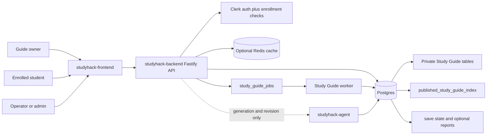
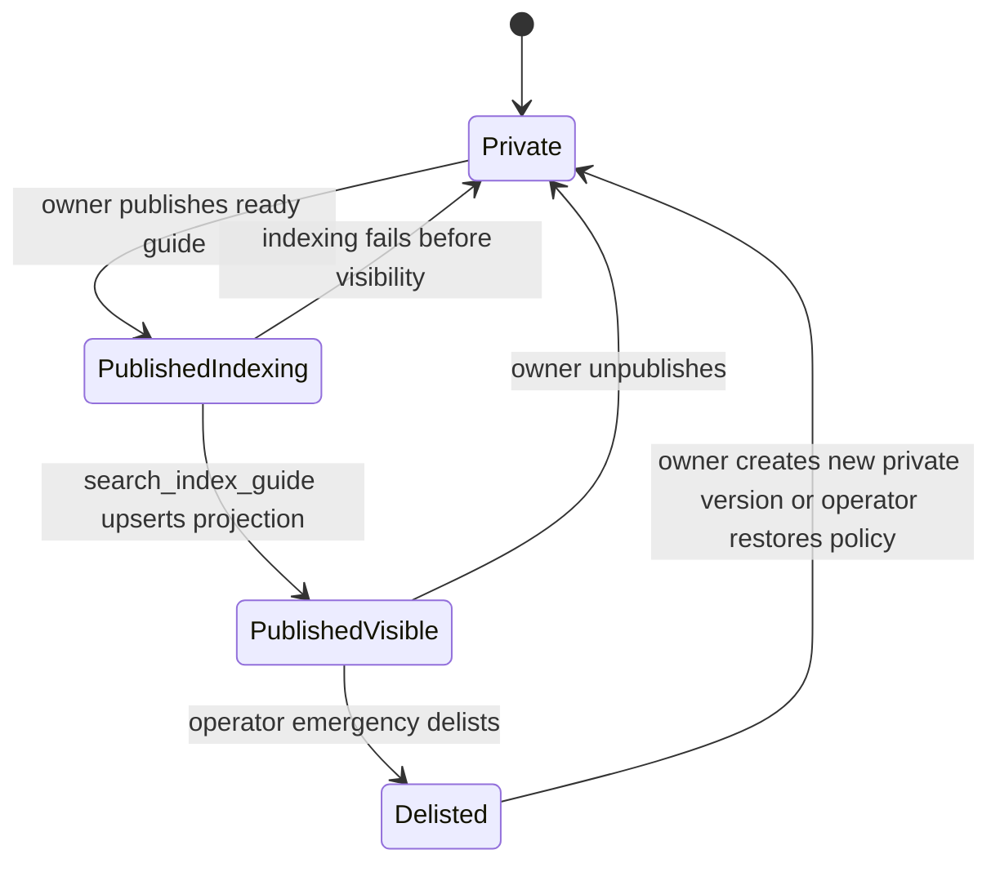
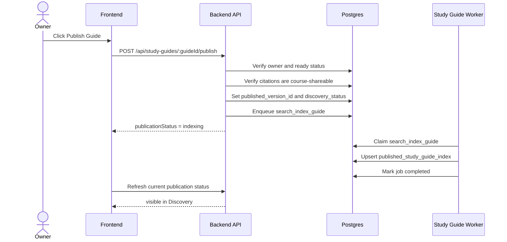
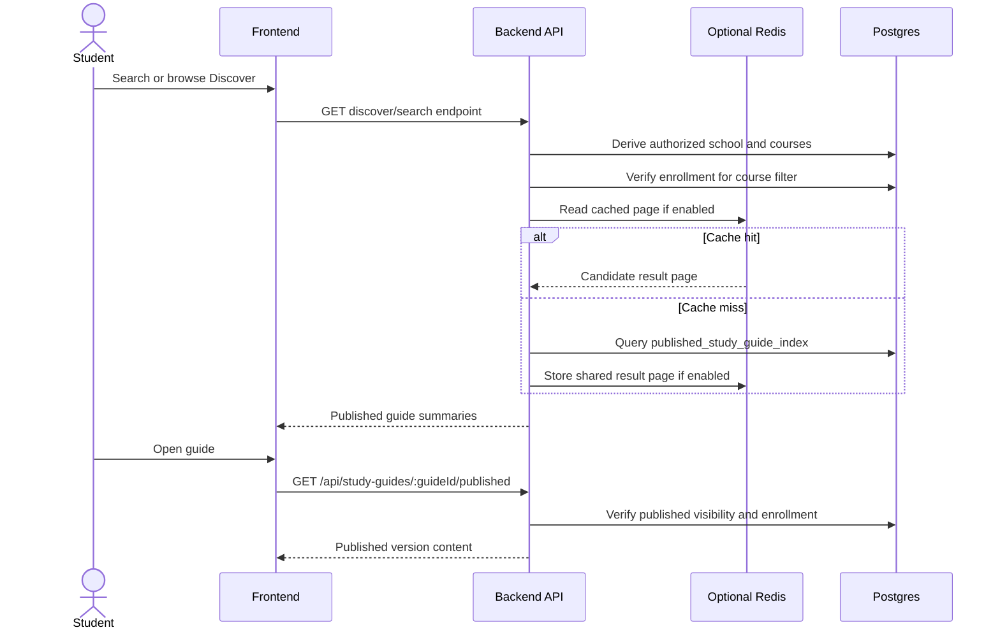
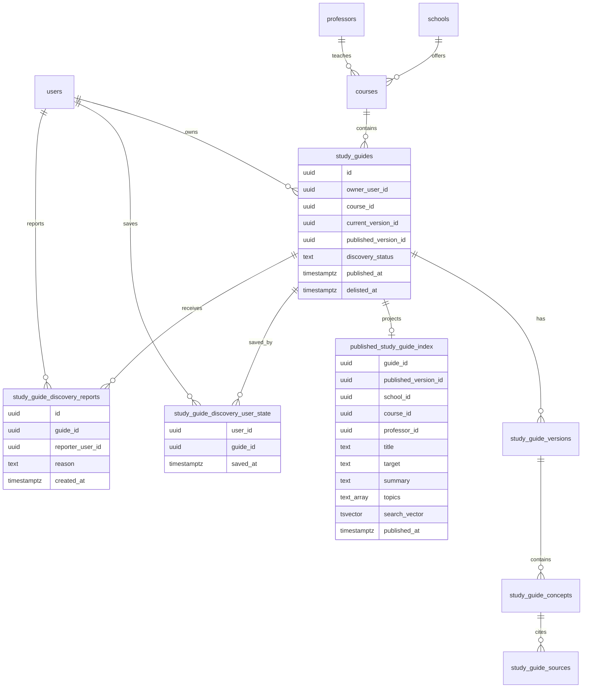

# Study Guide Discovery Design Doc

# Problem Context

Study Guides are currently owner-scoped artifacts: a student generates a saved guide for a course, reopens it later, edits it, and can request AI revisions. The next product step is Discovery: students should be able to find useful published Study Guides from their school and course instead of starting from a blank generation every time.

Discovery must preserve the Study Guide trust model. A guide is only discoverable after an explicit publish path, search must respect school and course boundaries, and ranking must not require scanning every saved guide on each request.

# Proposed Solution

Add a Discover surface backed by a Postgres published-guide projection, asynchronous indexing jobs, basic search, save actions, emergency delist support, and beta-grade operational telemetry. Later phases add richer feedback, advanced recommendations, semantic retrieval, and learned ranking. The persisted Study Guide tables remain the source of truth; Discovery reads from a smaller `published_study_guide_index` projection that contains searchable metadata and pointers back to authorized published guide content.

The beta launch should be product-complete enough for real student use: explicit publish/unpublish, course-scoped browse, basic search, published-guide result pages, save actions, emergency delist, a published-guide projection, simple safe ordering, and backend-owned authorization. Hide, recommendations, heavy personalization, semantic search, learned ranking, and complex cache warming are post-beta. Report can ship in beta only if a product/operator owner exists for triage and emergency delist decisions.

# Visual Overview

## System Context



## Beta Publish State



`Private` maps to `study_guides.discovery_status='private'` and no projection row. `PublishedVisible` maps to `discovery_status='published'` plus one row in `published_study_guide_index`. `Delisted` removes the projection row but keeps the owner's private guide.

# Current Repo Baseline


## Frontend

The frontend already has a persisted Study Guide workspace:

* `components/course/PersistedStudyGuidePanel.tsx` lists owner-scoped guides for a course, creates new guides, polls queued/generating status, renders the current version, loads historical versions, saves manual edits, and submits concept-scoped AI revisions.
* `types/api.ts` defines Study Guide DTOs for private guide status, versions, concepts, citations, and revision requests.
* There is no Discover UI, published guide result type, search client, save/report flow for published guides, or public/published guide route.

Discovery should therefore be added as a new surface beside the existing private saved-guide workspace, not by replacing the current generation/editing panel.

## Backend

The backend already owns persisted Study Guide state and authorization:

* `src/routes/study-guides.ts` exposes private owner-scoped create/list/get/version/edit/revision endpoints.
* `src/study-guides/service.ts` validates Study Guide input and agent output, persists immutable versions, reauthorizes sources before persistence, enforces idempotency, and returns `404` for cross-user access.
* `migrations/0019_study_guides.sql` creates the core Study Guide tables, immutable version tables, source tables, revision request table, durable job table, idempotency table, and job-run telemetry.
* The `study_guide_jobs` enum already reserves future job types for `publish_guide`, `search_index_guide`, `ranking_refresh`, `recommendation_refresh`, and `cache_warm`.
* `src/worker.ts` currently claims only `generate_guide` and `revise_guide` jobs. It does not process publish, indexing, ranking, recommendation, or cache-warming jobs yet.
* There is no `published_study_guide_index`, Discovery save/report table, Redis integration, publish/unpublish route, Discover route, emergency delist route, or ranking implementation.
* The current schema does include normalized `schools`, `professors`, `courses.school_id`, `courses.professor_id`, and `enrollments`, so Discovery can scope browse/search by school and course without a catalog migration.

Discovery should build on the existing backend ownership boundary: the backend derives the user from auth, verifies enrollment where required, and decides whether a guide is publishable or readable.

## Agent

The agent already supports grounded structured Study Guide generation:

* `src/server.ts` exposes `/study-guide/generate` and `/study-guide/revise` behind internal bearer auth.
* `src/retrieve.ts` provides `retrieveForStudyGuide`, which filters by `courseId` and by owner when retrieval mode is `personal`.
* `src/study.ts` generates strict JSON Study Guide concepts and citations from retrieved course materials.

The first Discovery release should not require the agent on the interactive request path. Optional semantic topic indexing can reuse the existing embedding stack later, but browse/search/recommendation should initially run from backend-managed projection rows and cached result lists.

# Goals and Non-Goals

## Goals

* Let students browse published Study Guides for an enrolled course.
* Add explicit publish and unpublish workflows for ready private guides.
* Keep private guides private until publication is requested and indexed.
* Use a published projection so browse queries do not join the full Study Guide content graph.
* Enforce school, course, enrollment, publication, and emergency delist boundaries in the backend.
* Add operational observability for publish-to-index latency, query latency, zero-result rate, and indexing failures.

## Non-Goals

* Cross-school public search in the beta launch.
* Recommendations, semantic search, learned ranking, or collaborative filtering in the beta launch.
* A machine-learned ranking model before sufficient unbiased interaction data exists.
* Publishing private or failed guides.
* Using Discovery to bypass material, enrollment, publication, delist, or ownership checks.

# Phasing

## Beta Launch

The beta launch is the first production-facing Discovery release. It must be safe enough for real users and useful enough that students can find shared guides without knowing the exact title.

* Owner-only publish/unpublish for ready Study Guides.
* Course Discover for enrolled students.
* Basic search over title, target, course code, professor, summary, and topics using Postgres full-text search; trigram matching is included if `pg_trgm` is already available in the environment.
* Published-guide open/read flow with published-version semantics.
* Save action. Report action only if beta has an explicit triage owner.
* `published_study_guide_index` projection.
* Simple ordering by text relevance for search and `published_at DESC` for browse.
* Backend-derived school/course authorization.
* Synchronous unpublish visibility removal.
* Operational metrics for publish-to-index latency, search latency, zero-result rate, indexing failures, reports if enabled, and unpublish-to-invisible latency.
* Redis read-through caching is optional for beta. If provisioned, it must be safe to bypass; indexed Postgres queries remain the fallback.

## Post-Beta Search and Ranking

Improve search quality and ranking after beta usage data reveals real query patterns.

* Autocomplete.
* Trigram search if not shipped in beta.
* Redis read-through caching if not shipped in beta.
* Hide action.
* Impression/open analytics with signed result context.
* Ranking signal refresh from interaction data.
* Hybrid ranking across lexical, trigram, and optional semantic channels.
* Lightweight personalization.
* Recommended lists.
* Semantic topic search if lexical/trigram search is insufficient.

## Later Ranking Platform

Add advanced ranking only after enough unbiased usage data exists.

* Offline ranking evaluation with Recall@50, NDCG@10, MRR, and A/B tests.
* Learned ranking or LambdaMART.
* Exploration/bandit strategies, if ever justified.

# Design

## 1. User Experience

### Publish vs Discover

Publish and Discover are separate product surfaces:

* **Publish** is an owner action on the student's current private Study Guide. It opens a publish dialog, lets the owner set title/description, validates publish safety, snapshots the `published_version_id`, and creates or refreshes the Discovery projection.
* **Discover** is a consumer browsing/search surface. It shows already-published guides from other students, lets the current user search, open, save, and optionally report them, and never mutates the current user's private Study Guide unless the user explicitly copies a published guide into their own workspace.

The top-bar `Publish` button belongs to the current guide's owner workflow. The top-bar `Discover` button switches the workspace into the Discovery browse/search view. Pressing `Discover` must not publish the current guide. Pressing `Publish Guide` must not run a recommendation/search query; it only changes the publication state of the current guide and enqueues indexing.

Beta supports only **course-only** visibility: a published guide is discoverable only to students authorized for the same course. Do not expose a disabled `Public / Anyone on StudyHack` option in the beta publish dialog; add broader visibility only after cross-school/global discovery policy, abuse handling ownership, and citation privacy rules are finalized.

Discovery appears in the Study Guide area as:

* **Beta Course Discover:** published guides for the current course.
* **Beta Search:** query box that understands course codes, professor names, targets, topics, and common spelling/formatting differences.
* **Post-Beta Recommended:** a shared ranked list for the student's school or course, lightly adjusted for enrolled courses, professor matches, recent targets, saves, and hides.

In beta, each result card shows title, course, target, professor when known, top topics, publish age, source/grounding indicator, and whether the current user has saved it. Smoothed open/save counts and hide state can be hidden until later phases.

Opening a result creates an authorized read of the published guide. If the guide is later removed from the index, direct access should return `404` unless the student owns the guide or has a separate saved copy.

Frontend implementation should add separate Discovery DTOs and API client calls instead of overloading the private `StudyGuide` DTO. Published results are summaries; opening a result can return the published current version, while saving/copying a result can be a separate product decision.

### Publish Sequence



### Discover Search and Open Sequence



## 2. Publish Boundary

Discovery indexes only guides that satisfy all of these conditions:

* guide status is `ready`;
* the current version has valid structured content and citations;
* the owner explicitly published it, or a future product policy marks it publishable;
* the guide has not been manually delisted;
* guide course belongs to the same school scope used by Discover;
* guide is not deleted, unpublished, or otherwise removed;
* every citation in the published view is backed by course-shareable material.

Publishing is a separate workflow from guide generation. Generation creates private study artifacts; publishing creates a discoverable artifact and an indexing job.

The backend should add explicit publish metadata rather than inferring publication from `study_guides.status`. A ready guide is still private until a publish action or policy creates the published projection.

Citation authorization for publishing is stricter than private guide generation. A private guide may cite material uploaded by its owner under `retrievalMode=personal`; publishing that guide must not leak a private PDF name, snippet, or page reference to classmates. In beta, if a guide contains citations that are not eligible for course sharing, the publish request is rejected. Citation-level redaction is deferred.

## 3. Data Model

Study Guide content remains normalized in the existing `study_guides`, `study_guide_versions`, `study_guide_concepts`, `study_guide_key_points`, and `study_guide_sources` tables. Discovery adds projection and interaction tables.

```sql
ALTER TABLE study_guides
  ADD COLUMN published_version_id uuid,
  ADD COLUMN published_at timestamptz,
  ADD COLUMN discovery_status text NOT NULL DEFAULT 'private',
  ADD COLUMN delisted_at timestamptz,
  ADD COLUMN delisted_reason text,
  ADD CONSTRAINT chk_study_guides_discovery_status
    CHECK (discovery_status IN ('private', 'published', 'delisted'));

CREATE TABLE published_study_guide_index (
  guide_id uuid PRIMARY KEY REFERENCES study_guides(id) ON DELETE CASCADE,
  published_version_id uuid NOT NULL REFERENCES study_guide_versions(id),
  owner_user_id uuid NOT NULL REFERENCES users(id),
  school_id uuid NOT NULL REFERENCES schools(id),
  course_id uuid NOT NULL REFERENCES courses(id),
  professor_id uuid REFERENCES professors(id),
  title text NOT NULL,
  target text,
  summary text NOT NULL,
  topics text[] NOT NULL DEFAULT '{}',
  search_vector tsvector,
  published_at timestamptz NOT NULL,
  updated_at timestamptz NOT NULL DEFAULT now()
);

CREATE INDEX idx_published_guides_course_browse
  ON published_study_guide_index (school_id, course_id, published_at DESC);

CREATE INDEX idx_published_guides_school_browse
  ON published_study_guide_index (school_id, published_at DESC);

CREATE INDEX idx_published_guides_search_vector
  ON published_study_guide_index USING gin (search_vector);

CREATE INDEX idx_published_guides_topics
  ON published_study_guide_index USING gin (topics);
```

`study_guides.discovery_status` is the source of truth. The projection contains only currently visible published rows. Unpublish and delist delete the projection row before returning success. Beta does not assume a staffed moderation queue or a full review workflow. Reports create operational signals; an admin/operator can manually set `discovery_status='delisted'` as an emergency safety action.

`published_study_guide_index.owner_user_id`, `school_id`, `course_id`, and `professor_id` are intentionally duplicated from joined tables for read performance and bounded filtering. The indexing job is responsible for keeping them consistent with the source rows.

`search_vector` is written by `search_index_guide` when it upserts the projection. Beta search requires this field to be populated for published guides.

User state is stored separately so saving a published guide does not rewrite Study Guide content.

```sql
CREATE TABLE study_guide_discovery_user_state (
  user_id uuid NOT NULL REFERENCES users(id),
  guide_id uuid NOT NULL REFERENCES study_guides(id) ON DELETE CASCADE,
  saved_at timestamptz,
  created_at timestamptz NOT NULL DEFAULT now(),
  updated_at timestamptz NOT NULL DEFAULT now(),
  PRIMARY KEY (user_id, guide_id)
);
```

If report ships in beta, use an explicit report table rather than a generic analytics event stream:

```sql
CREATE TABLE study_guide_discovery_reports (
  id uuid PRIMARY KEY DEFAULT gen_random_uuid(),
  guide_id uuid NOT NULL REFERENCES study_guides(id) ON DELETE CASCADE,
  reporter_user_id uuid NOT NULL REFERENCES users(id),
  reason text NOT NULL,
  details text,
  created_at timestamptz NOT NULL DEFAULT now()
);

CREATE INDEX idx_discovery_reports_guide_created
  ON study_guide_discovery_reports (guide_id, created_at DESC);
```

Open/impression analytics are post-beta unless there is a concrete ranking experiment that needs them.

The existing migration already permits Discovery job types in `study_guide_jobs`, but the beta worker implementation only needs `search_index_guide`.

### Data Relationship Diagram



## 4. APIs

```http
GET /api/courses/:courseId/study-guides/discover?page=1
```

Returns published guides for one enrolled course. Requires enrollment in `courseId`.

```http
GET /api/study-guides/discover/search?schoolId=uuid&courseId=uuid&q=smith%20cse101%20midterm&page=1
```

Searches within the user's authorized school scope. `schoolId` is a requested filter only; the backend derives the authorized school scope from the authenticated user's enrollments and rejects or ignores mismatches. `courseId` is optional, but if present the backend verifies enrollment before applying it.

```http
GET /api/study-guides/:guideId/published
```

Returns the published version of one discoverable guide. Requires the viewer to be authorized for the guide's course.

```http
PUT /api/study-guides/:guideId/save
DELETE /api/study-guides/:guideId/save
```

Adds or removes the published guide from the current user's saved list. This is a consumer action and does not modify the original guide.

```http
POST /api/study-guides/:guideId/report
```

Optional beta endpoint. Create only if report triage ownership exists.

```http
POST /api/study-guides/:guideId/publish
Idempotency-Key: <client-generated-key>
```

Publishes the current ready version, stores publish metadata, and enqueues `search_index_guide`. Owner-only in beta.

Returns a publication state such as:

```json
{
  "guideId": "guide-uuid",
  "publishedVersionId": "version-uuid",
  "publicationStatus": "indexing"
}
```

The guide is considered published after metadata commits, but it is discoverable only after the projection is indexed. Publish-to-searchable latency is tracked operationally.

```http
POST /api/study-guides/:guideId/unpublish
Idempotency-Key: <client-generated-key>
```

Removes the guide from Discovery and invalidates affected caches without deleting the owner's private guide.

Unpublish must remove visibility synchronously by setting `study_guides.discovery_status='private'`, clearing `published_version_id` and `published_at`, and deleting the projection row before returning success. Cache cleanup can be asynchronous, but stale cache entries must either be invalidated immediately or filtered by a backend visibility check before response.

These routes do not exist today; they are required before any guide can enter Discovery.

## 5. Query Pipeline

The beta course browse path is deliberately bounded:

```text
derive authorized courses
-> require enrollment for courseId
-> read published rows from published_study_guide_index
-> order by published_at DESC
-> return paginated summaries
```

Beta search uses indexed lexical retrieval:

```text
normalize query
-> parse deterministic entities
-> apply school/course/publication/delist hard filters
-> retrieve lexical candidates
-> optionally retrieve trigram candidates
-> order by lexical relevance and published_at
-> optionally read/write shared cache
-> return paginated results
```

Normalization lowercases, trims whitespace, and normalizes course-code spacing. Beta can match professor display names directly; alias tables and ambiguous entity resolution are post-beta unless the current catalog already provides the needed alias data.

## 6. Ranking

Beta browse ranking should be simple and explainable:

```text
ORDER BY published_at DESC
```

Beta search ranking combines lexical relevance with recency:

```text
ORDER BY lexical_relevance DESC, published_at DESC
```

Post-beta ranking may combine lexical, trigram, semantic, content quality, freshness, and interaction signals. Exact fusion and reranking formulas should be defined in a separate ranking RFC after usage data and evaluation sets exist.

Course, school, publication status, and delist status are hard filters. They are not ranking weights.

## 7. Personalization

Personalization is not part of beta ranking except for marking guides the user has saved. Post-beta personalization happens after a shared ranked page is loaded from cache. It may boost or suppress only within the top result window based on:

* courses the student is enrolled in;
* matching professor;
* recent targets such as midterm, final, or week number;
* guides already saved by the user;
* guides hidden by the user, if hide is added.

The system does not maintain full per-user result caches. This keeps cache reuse high and limits privacy risk.

## 8. Caching

Redis is optional for beta. Beta endpoints must work from indexed Postgres reads with page-size limits. If Redis is provisioned for beta, it stores shared Discover and search responses only; recommendation and autocomplete caches are post-beta. Postgres remains the source of truth.

Suggested keys:

```text
discover:v1:school:{schoolId}:course:{courseId}:sort:{sort}:page:{page}
discover-search:v1:{normalizedQueryHash}:school:{schoolId}:course:{courseId}:page:{page}
```

Initial TTLs:

* Browse results: 5-15 minutes.
* Search results: 5 minutes.
* Empty results: 30-60 seconds.

When Redis is enabled, invalidate affected keys when a guide is published, unpublished, delisted, reindexed, or when course/professor metadata changes. If Redis is unavailable, fall back to indexed Postgres queries. Never fall back to full-table scans.

## 9. External Recommendation API Evaluation

Because StudyHack may not have engineering bandwidth to maintain hand-written ranking and recommendation algorithms, managed recommendation/search APIs should be evaluated explicitly. They are not allowed to decide visibility or authorization, but they may reduce post-beta maintenance if Discovery grows beyond simple indexed search.

Beta still launches with deterministic Postgres search and browse because it has cold-start data, strict course/enrollment filters, and private citation constraints. A managed provider becomes useful after StudyHack has enough published guides and user interactions to justify catalog sync, event sync, privacy review, and provider fallback.

| Provider | Price shape | Scale | Pros | Cons | Fit |
| --- | --- | --- | --- | --- | --- |
| Recombee | Free tier; paid self-serve starts around `$99/month`; higher tiers scale by interactions, recommendation requests, active users, and catalog items. | Self-serve to millions of users/items; custom plans for high volume. | Recommendation-focused, not purely commerce; supports content-based, collaborative, popularity fallback, filters, and boosters. Lower maintenance than building ranking ML. | Requires catalog/event sync; third-party processing of user behavior; StudyHack must mirror course/enrollment filters before calling it. | Best post-beta recommendation-only candidate. |
| Amazon Personalize | Training around `$0.24/training-hour`; real-time recommendations start around `$0.0556/1k` requests at high-volume tiers; active campaigns can incur minimum provisioned TPS billing. | AWS-managed, high scale, autoscaling inference. | General managed recommendation ML; supports personalized ranking, similar items, trending, and batch recommendations. | More ML ops than Recombee; cold start; idle campaign cost; requires AWS/event pipeline maturity. | Good later if StudyHack is AWS-heavy and reaches meaningful interaction volume. |
| Algolia Search/Recommend | Search free tier then roughly `$0.50/1k` to `$1.75/1k` search requests depending on plan; Recommend free tier then roughly `$0.60/1k`; record storage also matters. | Mature low-latency global search infrastructure. | Strong search, typo tolerance, analytics, ranking tools, and recommendations in one vendor. Reduces maintenance if search quality becomes the main problem. | Vendor lock-in; cost grows with traffic and indexed records; Recommend is more product-discovery oriented. | Best candidate if StudyHack wants to outsource search plus discovery, not just recommendations. |
| Google AI Commerce Search / Retail Recommendations | Recommendations prediction roughly `$0.27/1k` for first 20M monthly predictions; training/tuning around `$2.50/node-hour`; commerce search/browse can be materially more expensive. | Very high Google-managed scale. | Powerful managed search/recommendation and personalization stack. | Commerce/product catalog assumptions fit Study Guides poorly; expensive and heavier than beta needs. | Not recommended unless Discovery becomes marketplace-scale. |

Provider integration rules:

* StudyHack always applies school, course, enrollment, publication, delist, and citation-privacy filters before sending candidates or item IDs to a provider.
* The provider can rerank or recommend only within authorized, visible published guides.
* StudyHack keeps `published_study_guide_index` as the deterministic fallback if the provider is unavailable or produces empty results.
* Do not send private material names, citation snippets, prompts, or personal-only source metadata to a provider without a privacy review.

Decision: beta should not hand-write a complex recommendation algorithm, but it also should not depend on a recommendation provider before there is interaction data. Keep beta ranking simple, instrument saves/reports/search behavior, and run a post-beta vendor spike comparing Recombee, Algolia, and Amazon Personalize against the deterministic Postgres baseline.

## 10. Background Jobs

Interactive browse/search requests run synchronously against indexed Postgres and, in later phases, Redis. Background jobs are used only for work that can happen outside the request path:

* `search_index_guide`

This job type uses the existing `study_guide_jobs` table introduced for persisted Study Guide generation. An active deduplication key ensures that at most one search_index_guide job is queued or running for a given guide. Repeated publish or reindex requests are merged into the existing job until it completes.

Beta does not need the full lane-aware scheduler. It needs the current worker to process `search_index_guide` with lower priority than `generate_guide` and `revise_guide`, respect attempts/backoff/dedupe keys, use a simple global indexing concurrency limit, and keep publish indexing out of request transactions.

Per-course and per-user fairness are deferred until observed workload demonstrates starvation. `publish_guide`, `ranking_refresh`, `recommendation_refresh`, and `cache_warm` remain future job types; beta publish commits metadata synchronously and enqueues only `search_index_guide`.

Agent calls should remain out of the interactive Discover path. If semantic search is added, embeddings should be computed asynchronously during indexing and stored in the projection or an adjacent index table.

## 11. Abuse Handling and Safety

Beta should not pretend to have a full moderation product if there is no review team or defined workflow. It still needs safety controls. Before inserting or refreshing `published_study_guide_index`, the backend verifies:

* the guide owner is still allowed to publish the guide;
* the guide's current version is valid;
* citations point to course-shareable materials;
* the guide has not been manually delisted;
* any reported guide can be manually delisted from Discovery without deleting the owner's private guide.

Reports and future hide actions can become ranking signals later. In beta, a report does not imply an automatic state transition unless product defines that policy. The minimal supported response is an operator/admin action that sets `discovery_status='delisted'`, records `delisted_at` and `delisted_reason`, and immediately excludes the guide from indexed Discover responses after cache invalidation.

## 12. Observability

Beta observability focuses on operational health and basic product quality:

* publish-to-index latency;
* indexing success/failure rate;
* Discover query latency p50/p95;
* search latency p50/p95;
* zero-result rate;
* save count and report count if report ships;
* stale projection count, if cheap to compute;
* unpublish-to-invisible latency.

Later ranking observability should record enough data to debug ranking without storing prompt text or private source contents:

* query, normalized query hash, school, course, page, rank, and ranking version;
* cache hit/miss and fallback-to-Postgres rate;
* indexed-but-not-visible count by delist reason;
* Recall@50, NDCG@10, and MRR from offline evaluation sets.

Future ranking changes should include a ranking version so metrics can compare old and new behavior.

# Alternatives Considered

| Approach | Decision | Reason |
| --- | --- | --- |
| Scan and rank all saved Study Guides per request | Reject | Does not scale and risks mixing private, unpublished, or unauthorized guides into candidate generation. |
| Popularity-only ranking | Reject | Creates a rich-get-richer loop and hides new high-quality guides. |
| Fully personalized ranking | Defer | Low cache reuse, privacy concerns, cold-start problems, and higher operational cost. |
| Collaborative filtering | Reject for beta | Interaction data will be sparse and biased early on. |
| Learning-to-rank model | Defer | Requires enough unbiased labels, a training pipeline, monitoring, and A/B testing. |
| External search service | Defer | Postgres FTS, trigram search, projection tables, and optional Redis are sufficient for beta. |
| Managed recommendation APIs | Defer | Amazon Personalize, Recombee, Algolia Recommend, and Google Retail-style services require catalog/event pipelines and enough interaction data; they can be evaluated post-beta in a separate vendor RFC. |

# Rollout Plan

1. Beta backend migration: add publish metadata, `discovery_status` source-of-truth fields, `published_study_guide_index`, save state, optional reports, search vector, and operational indexes.
2. Beta backend routes: add owner-only publish/unpublish, enrolled course Discover, basic search, published-guide open/read, save/unsave, optional report, and emergency delist.
3. Beta worker: add `search_index_guide` handling to upsert projection rows and compute search vectors.
4. Beta frontend: add a course Discover/search surface, result cards, open published guide, save action, optional report action, and publish/unpublish controls on owned ready guides.
5. Beta observability: add publish-to-index latency, indexing failures, browse/search latency, zero-result rate, save/report counts, and unpublish-to-invisible latency.
6. Post-beta: add hide, autocomplete, broader Redis caching if not already enabled, signed impression tokens, hybrid ranking, personalization, recommendations, semantic retrieval, offline ranking evaluation, and A/B testing.

# Acceptance Criteria

* Private, failed, unpublished, delisted, or cross-school guides never appear in Discovery.
* Course Discover requires enrollment and returns only published guides for that course.
* Beta search applies hard school/course/publication/delist filters before ranking.
* Beta result pages are served from indexed Postgres queries; cached pages degrade to bounded Postgres queries if Redis fails.
* Publishing, unpublish, or delist changes synchronously remove visibility from indexed results; later cached responses are invalidated or rechecked before response.
* A guide can be removed from Discovery without deleting the owner's private Study Guide.
* Zero-result and latency metrics are visible in operational dashboards.

# Open Questions

* What exact user action publishes a guide, and should instructors have approval controls?
* Should published guides expose full content directly, or require saving/copying into the student's workspace first?
* Who owns report triage and emergency delist decisions during beta?
* Should post-beta search include semantic topic search, or only FTS plus trigram search?
* If beta enables Redis, what Redis instance owns Study Guide cache keys in production?
